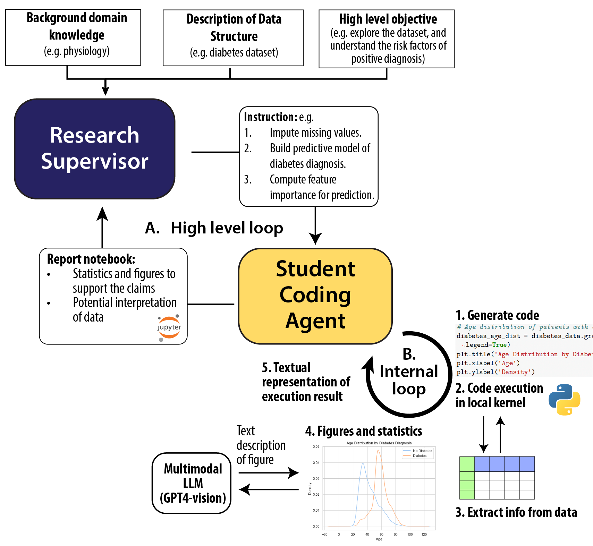

# GPT-Auto-Data-Analytics 

### Automate local data analysis with groups of tool-using GPT agents. 

ChatGPT and Code Interpreter has changed the way of data analysis.
But have you ever got frustrated about ...

* 🤔 Limited runtime and computing resources (no GPU access!)
* 📊 Challenges in handling large and complex local datasets (which is hard to upload)
* 📦 Certain Python packages being unavailable in online environment.
* 🚫 No vision ability to interpret the generated figures.
* 🧩 Lack of organized output from the analysis.


This project aims to replicate the online code interpreter experience locally, but also addressing all the issues mentioned above:

* 💻 Code generation and execution in a local Python kernel
* 📂 Full access to your data on local storage
* 🤖 A supervisor agent guides the coding agent to iteratively solve data analysis problems
* 👀 Vision capabilities for the coding agent to interpret visual figures
* 📚 Organized output, exported as Jupyter notebooks, PDF, and HTML

<!-- A data analysis project is usually motivated by a high level question and then break it down into  -->

<!-- ## 🚀 Current Project Status: Transforming Data Analysis

Here's a glimpse of the magic happening behind the scenes: -->

## 🚀 Installation
```bash
git clone https://github.com/Animadversio/GPT-Auto-Data-Analytics.git
cd GPT-Auto-Data-Analytics
pip install -e .
```
## Usage 

```python
# set up openai key env variable
from auto_analytics.tabular_analysis_session import TabularAnalysisPipeline
# Tell the agent some info about your data and columns, and your overall objective.
table_descriptions = """..."""
column_descriptions = """..."""
task_objective = """Perform explorative data analysis of this dataset to uncover relationships among different variables."""
csvpath = "~/GPT-Auto-Data-Analytics/table_data/Diabetes_Blood_Classification.csv"
report_root = "reports"

# Example usage
analysis_session = TabularAnalysisPipeline("Diabetes_Classification", csvpath, report_root=report_root)
# Set up dataset and column descriptions
analysis_session.set_dataset_description(table_descriptions, column_descriptions)
# Let supervisor agent setup and save analysis task
analysis_session.supervisor_set_analysis_task(task_objective, ) 
# Let research assitent perform data analysis
analysis_session.perform_data_analysis(query=None, MAX_ROUND=30)
# Save results to notebook, HTML, and PDF
analysis_session.save_results()
```

[Play with our Colab demo! ](https://colab.research.google.com/drive/17DnAiE6EdAtLfX7xjdxvMEV5HUtBKTq6?usp=sharing)

[Video walk-through of our system ](https://youtu.be/APP0uvU3QAQ?si=B4bVy646wH1WkMxX)

### ✅ Current Features 🌟

- **Auto Analytics in Local Env:** The coding agent have access to a local python kernel, which runs code and interacts with data on your computer. No more concerns about file uploads, compute limitations, or the online ChatGPT code interpreter environment. Leverage any Python library or computing resources as needed.
- **Collaborative Intelligence:** We've built a team of LLM agents assuming the roles of research supervisor and coding assistant. Their interaction allows the supervisor's overarching vision to guide the detailed coding and data analysis process, leading to a cohesive report.
- **Tabular Data Analysis:** Full support for tabular data analysis (e.g., Kaggle competitions). From tables to analytical insights in one step.
- **Vision Analytics:** Integration with Vision API enables the data analytics agent to generate and understand the meaning of plots in a closed loop.
- **Versatile Report Export:** After automated data analysis, a Jupyter notebook is generated, combining code, results, and visuals into a narrative that tells the story of your data. Exports are available in Jupyter notebook, PDF, and HTML formats for your review and reproduction.

### How does it work? 

<details>
  <summary>Click to expand!</summary>

  **System Overview**. Our high-level idea is to emulate the workflow in research labs: we will assign roles to AI agents, such as research supervisor or student coding agent and let them work in a closed loop. The supervisor, equipped with broader background knowledge, is tasked to set an overarching research goal, and then break it down into detailed code-solvable tasks which are sent to the student. Then, the student coding agent, equipped with coding tool and vision capability, will tackle the tasks one-by-one, synthesizing their findings into reports for the supervisor's review. This iterative process allows the supervisor to refine their understanding and possibly adjust the research agenda, prompting further investigation. Through this collaborative effort, both parties converge to a unified conclusion, culminating in a final report with code, figures and text interpretations. 

  **Internal Coding Loop**. At the core of our system lies the coding agent, an LLM agent who is tasked for conducting interactive data analysis. This agent will take in task objective, and then analyze datasets by outputting code snippets, which are executed in a local IPython kernel. The results of code execution (including error message) will be sent back to LLM in the form of text strings. Notably, when figures are generated, they will also be turned into text descriptions by a multimodal LLM prompted to interpret the figure .
  
</details>

### 🌐 What's Next?
- [ ] Better report summarization.
- [ ] Enhanced report presentation. (filtering, formating etc.)
- [ ] CLI interface to auto data analysis. 
- [ ] Addressing complex, multi-file data analysis challenges.
- [ ] Tackling multi-modal data analysis problems, including text, image and neural data.
- [ ] Enhancing multi-round communication between the supervisor and the coding agent, adjusting the research goal based on the report

## Join Us on This Journey
As an end goal, we hope our tools can auto-pilot data analysis on its own. 
If you're interested in using our tool in your daily data analysis work or scientific research, we'd love to hear your thoughts and what you find interesting!

* Binxu Wang 
* **Email**: binxu_wang@hms.harvard.edu


